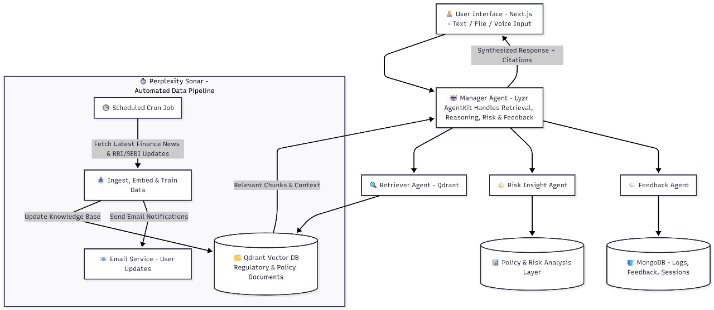

<div align="center">
  <h1>FinRegent</h1>
  <p><strong>Agentic AI for Financial Governance & Compliance</strong></p>
  <p>Multi-agent reasoning with real-time regulatory intelligence for financial institutions</p>

  <p>
    <a href="https://nextjs.org/">
      
    </a>
    <a href="https://www.typescriptlang.org/">
      
    </a>
    <a href="https://react.dev/">
      
    </a>
    <a href="https://www.prisma.io/">
      
    </a>
    <a href="https://www.mongodb.com/">
      
    </a>
  </p>
</div>

---

FinRegent is an enterprise-grade AI compliance platform that transforms how financial institutions manage regulatory requirements. Built on an **Agentic RAG Framework**, it provides autonomous reasoning capabilities to help compliance teams navigate complex regulations from RBI, SEBI, and other regulatory bodies with confidence and transparency.

---

FinRegent is an enterprise-grade AI compliance platform that transforms how financial institutions manage regulatory requirements. Built on an **Agentic RAG Framework**, it provides autonomous reasoning capabilities to help compliance teams navigate complex regulations from RBI, SEBI, and other regulatory bodies with confidence and transparency.

## Why FinRegent?

Financial compliance is complex, time-consuming, and constantly evolving. FinRegent simplifies this challenge by:

- **Understanding Context**: Ask questions in natural language and receive precise, contextual answers backed by regulatory sources
- **Autonomous Reasoning**: Multi-agent system that can analyze, cross-reference, and provide explainable compliance guidance
- **Real-time Intelligence**: Automatic monitoring and integration of regulatory updates from multiple sources
- **Unified Knowledge**: Seamlessly combines RBI guidelines, SEBI requirements, and internal policies in one intelligent system

## Features

### 🤖 AI-Powered Compliance Assistant

Natural language chat interface powered by Lyzr AI agents trained on financial regulations. Get instant answers to compliance questions with:

- **Contextual Understanding**: Multi-turn conversations that maintain context across sessions
- **Source Attribution**: Every response includes citations and confidence scores
- **Voice Interaction**: Hands-free compliance queries with voice input/output
- **Streaming Responses**: Real-time answer generation with rich markdown formatting

### 📚 Intelligent Document Management

Centralized knowledge base for all regulatory documents:

- **Auto-Classification**: Automatic categorization by source (RBI, SEBI, Internal) and category
- **Smart Search**: Tag-based filtering and full-text search across all documents
- **AI Processing**: Automated summarization and key point extraction
- **Version Control**: Track document changes and maintain compliance history

### 🔄 Automated Regulatory Updates

Stay current with evolving regulations:

- **Scheduled Monitoring**: Automated bi-weekly checks for regulatory updates
- **Link Extraction**: AI agent extracts relevant links from regulatory websites
- **Knowledge Base Training**: Automatically trains RAG system with new information
- **Email Notifications**: Get notified when your knowledge base is updated

### 🔐 Enterprise Security

Built with security and compliance in mind:

- **Clerk Authentication**: Enterprise-grade SSO and user management
- **API Signature Verification**: Cryptographic signatures for all API requests
- **Webhook Integration**: Real-time user synchronization with audit trails
- **Role-Based Access**: Granular permission controls (coming soon)

### 🎨 Modern User Experience

Beautiful, responsive interface that works everywhere:

- **Dark Mode Support**: Full theme customization with persistent preferences
- **Responsive Design**: Optimized for desktop, tablet, and mobile
- **Accessibility First**: WCAG 2.1 compliant UI components
- **Real-time Updates**: Live activity tracking with visual timeline

## Quick Start

### Prerequisites

- Node.js 18.x or higher
- MongoDB database (local or [MongoDB Atlas](https://www.mongodb.com/cloud/atlas))
- [Clerk](https://clerk.com/) account for authentication
- [Lyzr AI](https://lyzr.ai/) account and API credentials

### Installation

1. Clone the repository:

```bash
git clone https://github.com/AJAmit17/NH-SJC25HACK-GenAI-026-Team-UDAAN.git
cd NH-SJC25HACK-GenAI-026-Team-UDAAN
```

2. Install dependencies:

```bash
npm install
```

3. Configure environment variables:

Create a `.env` file in the root directory:

```env
# Clerk Authentication
NEXT_PUBLIC_CLERK_PUBLISHABLE_KEY=pk_test_...
CLERK_SECRET_KEY=sk_test_...
CLERK_WEBHOOK_SECRET=whsec_...

# Database
DATABASE_URL="mongodb+srv://..."

# Lyzr AI
LYZR_API_KEY=sk-default-...
LYZR_AGENT_ID=...
LYZR_RAG_ID=...
LYZR_UPDATES_AGENT_ID=...
LYZR_LINK_EXTRACTION_AGENT_ID=...
LYZR_AUTO_RAG_ID=...

# Security
API_SIGNATURE_SECRET=your_random_secret_min_32_chars

# Inngest (for scheduled jobs)
INNGEST_SIGNING_KEY=...
INNGEST_EVENT_KEY=...

# Email Notifications
EMAIL_HOST=smtp.gmail.com
EMAIL_PORT=587
EMAIL_SECURE=false
EMAIL_USER=your-email@gmail.com
EMAIL_PASS=your-app-password
```

4. Initialize the database:

```bash
npx prisma generate
npx prisma db push
```

5. Start the development server:

```bash
npm run dev
```

Visit [http://localhost:3000](http://localhost:3000) to see your application.

## Architecture

### Architecture Diagram

<p align="center">
  
</p>

- **Client Layer**: Next.js UI with Clerk-secured access.
- **Services Layer**: Lyzr agents, Prisma API, and signature verification.
- **Data & Jobs**: MongoDB storage plus Inngest-driven regulatory updates.

### Tech Stack

| Category | Technologies |
|----------|-------------|
| **Framework** | Next.js 15 (App Router), React 19 |
| **Language** | TypeScript |
| **Database** | MongoDB + Prisma ORM |
| **Authentication** | Clerk |
| **AI/ML** | Lyzr AI Agents |
| **Styling** | Tailwind CSS, Shadcn UI |
| **State Management** | TanStack Query (React Query) |
| **Background Jobs** | Inngest |
| **Email** | Nodemailer |
| **Real-time** | Server-Sent Events (SSE) |

### Key Components

#### Multi-Agent System

FinRegent uses a specialized multi-agent architecture:

- **Chat Agent**: Main conversational interface for compliance queries
- **Link Extraction Agent**: Automatically discovers relevant regulatory documents
- **Updates Agent**: Monitors and processes regulatory changes
- **RAG Agent**: Retrieves and augments responses with knowledge base context

#### API Security Layer

All API requests use cryptographic signature verification:

```typescript
// Client generates signature
const signature = await generateSignatureAction(JSON.stringify(payload));

// Server verifies signature
const isValid = verifyApiSignature(payload, signature);
```

This ensures request integrity and prevents unauthorized API access.

#### Automated Training Pipeline

```
User Enables Cron Job
       ↓
Inngest Scheduled Function (Every 2 weeks)
       ↓
Link Extraction Agent → Discovers new regulatory documents
       ↓
RAG Agent → Trains knowledge base with new content
       ↓
Email Notification → User receives update summary
```

### Project Structure

```
finregent/
├── prisma/
│   └── schema.prisma              # Database schema (User, Document, Chat, etc.)
├── src/
│   ├── actions/
│   │   ├── api-key.ts            # Server action to fetch API keys
│   │   └── generate-signature.ts  # Cryptographic signature generation
│   ├── app/
│   │   ├── (auth)/               # Public authentication routes
│   │   ├── (routes)/             # Protected application routes
│   │   │   ├── workspace/        # Main chat workspace
│   │   │   ├── documents/        # Document management
│   │   │   ├── settings/         # User preferences
│   │   │   └── updates/          # Regulatory updates feed
│   │   └── api/
│   │       ├── lyzr/chat/        # Chat API with signature verification
│   │       ├── users/webhook/    # Clerk user synchronization
│   │       └── inngest/          # Background job endpoints
│   ├── components/
│   │   ├── chat.tsx              # Main chat interface
│   │   ├── sidebar/              # Navigation components
│   │   ├── shared/               # Reusable components (Timeline, VoiceChat)
│   │   └── ui/                   # Shadcn UI library (50+ components)
│   ├── lib/
│   │   ├── lyzrService.ts        # Lyzr AI integration
│   │   ├── security.ts           # Signature & webhook verification
│   │   ├── prisma.ts             # Database client
│   │   ├── email.ts              # Email service
│   │   └── inngest/              # Background job definitions
│   └── middleware.ts             # Auth & route protection
└── package.json
```

## Configuration

### Setting up Clerk

1. Create an application at [clerk.com](https://clerk.com/)
2. Configure sign-in options (Email, Google, etc.)
3. Copy API keys to `.env`
4. Add webhook endpoint:
   - URL: `https://your-domain.com/api/users/webhook`
   - Events: `user.created`, `user.updated`, `user.deleted`

### Setting up Lyzr AI

1. Sign up at [lyzr.ai](https://lyzr.ai/)
2. Create AI agents for:
   - **Main Chat Agent**: Compliance Q&A
   - **Link Extraction Agent**: Document discovery
   - **Updates Agent**: Regulatory monitoring
   - **RAG Agent**: Knowledge base management
3. Train agents with your regulatory documents
4. Copy agent IDs to `.env`

### Setting up Automated Updates

> [!NOTE]
> The automated training pipeline requires Inngest for scheduled jobs.

1. Create account at [inngest.com](https://www.inngest.com/)
2. Create a new app and copy keys to `.env`
3. Users can enable/disable automated updates in Settings
4. System runs bi-weekly (configurable in `src/lib/inngest/functions.ts`)

## Development

### Available Scripts

| Command | Description |
|---------|-------------|
| `npm run dev` | Start development server with Turbopack |
| `npm run build` | Build production bundle |
| `npm run start` | Start production server |
| `npm run lint` | Run ESLint |
| `npx prisma studio` | Open database GUI |
| `npx prisma db push` | Push schema changes to DB |

### API Endpoints

#### `POST /api/lyzr/chat`

Send a message to the AI compliance assistant.

**Request:**
```json
{
  "message": "What are the KYC requirements for banks?",
  "sessionId": "optional-session-id",
  "agentId": "your-agent-id",
  "userId": "user-id",
  "signature": "generated-signature",
  "assets": ["optional-file-ids"]
}
```

**Response:**
```json
{
  "response": "AI response content...",
  "session_id": "session-id",
  "user_id": "user-id"
}
```

#### `POST /api/users/webhook`

Clerk webhook endpoint for user synchronization.

**Events handled:**
- `user.created` - Creates user in MongoDB
- `user.updated` - Updates user information
- `user.deleted` - Removes user and associated data

#### `POST /api/lyzr/upload`

Upload documents to Lyzr AI for processing.

**Request:** Multipart form data with files

**Response:**
```json
{
  "assets": [
    {
      "asset_id": "...",
      "filename": "document.pdf"
    }
  ]
}
```

## Deployment

### Deploy to Vercel

[](https://vercel.com/new/clone?repository-url=https://github.com/AJAmit17/NH-SJC25HACK-GenAI-026-Team-UDAAN)

1. Push your code to GitHub
2. Import repository in [Vercel](https://vercel.com)
3. Add environment variables
4. Deploy

> [!IMPORTANT]
> Update Clerk webhook URL to your production domain after deployment.

### Environment Checklist

Ensure all variables are set:
- ✅ Clerk credentials (publishable key, secret, webhook secret)
- ✅ MongoDB connection string
- ✅ All Lyzr AI agent IDs and API key
- ✅ API signature secret (min 32 characters)
- ✅ Inngest keys (for automated updates)
- ✅ Email configuration (for notifications)

## Troubleshooting

<details>
<summary><strong>Database Connection Issues</strong></summary>

- Verify MongoDB connection string format
- Check IP whitelist in MongoDB Atlas
- Ensure database user has read/write permissions
- Run `npx prisma generate` to regenerate client
</details>

<details>
<summary><strong>Authentication Errors</strong></summary>

- Verify Clerk API keys in `.env`
- Check that redirect URLs match your domain
- Ensure webhook endpoint is accessible
- Clear browser cookies and localStorage
</details>

<details>
<summary><strong>AI Not Responding</strong></summary>

- Verify Lyzr API key and agent IDs
- Check that agents are properly trained
- Review browser network tab for API errors
- Ensure signature generation is working (check console)
</details>

<details>
<summary><strong>Build Errors</strong></summary>

- Delete `.next` folder and `node_modules`
- Run `npm install` fresh
- Check for TypeScript errors with `npm run lint`
- Ensure all environment variables are set
</details>

## Resources

- [Next.js Documentation](https://nextjs.org/docs)
- [Clerk Documentation](https://clerk.com/docs)
- [Lyzr AI Documentation](https://docs.lyzr.ai/)
- [Prisma Documentation](https://www.prisma.io/docs)
- [Shadcn UI Components](https://ui.shadcn.com/)
- [RBI Regulatory Guidelines](https://www.rbi.org.in/)
- [SEBI Regulations](https://www.sebi.gov.in/)

---

<div align="center">
  <p>Built with ❤️ by <strong>Team UDAAN</strong></p>
  <p>
    <a href="https://github.com/AJAmit17/NH-SJC25HACK-GenAI-026-Team-UDAAN">GitHub</a> •
    <a href="https://lyzr.ai/">Powered by Lyzr AI</a>
  </p>
</div>
